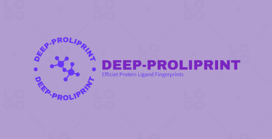
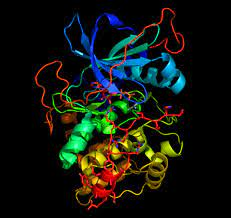

# Protein-Ligand-Fingerprinting

```python
python3 main.py --pdb ./data/2xni.pdb --output output/2xni.txt
```
# Protein-Ligand-Fingerprinting

<div id="top"></div>
<!--
*** Thanks for checking out the Best-README-Template. If you have a suggestion
*** that would make this better, please fork the repo and create a pull request
*** or simply open an issue with the tag "enhancement".
*** Don't forget to give the project a star!
*** Thanks again! Now go create something AMAZING! :D
-->

<!-- PROJECT SHIELDS -->
<!--
*** I'm using markdown "reference style" links for readability.
*** Reference links are enclosed in brackets [ ] instead of parentheses ( ).
*** See the bottom of this document for the declaration of the reference variables
*** for contributors-url, forks-url, etc. This is an optional, concise syntax you may use.
*** https://www.markdownguide.org/basic-syntax/#reference-style-links
-->

[![Contributors][contributors-shield]][contributors-url]
[![Forks][forks-shield]][forks-url]
[![Stargazers][stars-shield]][stars-url]
[![Issues][issues-shield]][issues-url]
[![MIT License][license-shield]][license-url]
[![LinkedIn][linkedin-shield]][linkedin-url]

<!-- PROJECT LOGO -->
<br />
<div align="center">
  <a href="https://github.com/debajyotidasgupta/raft-consensus">
    
  </a>

  <h3 align="center">Protein Ligand Fingerprinting</h3>

  <p align="center">
    Methods to obtain fingerprint for a protein-ligand complex.
    <br />
    <a href="https://github.com/debajyotidasgupta/Protein-Ligand-Fingerprinting/wiki"><strong>Explore the docs »</strong></a>
    <br />
    <br />
    <a href="https://github.com/debajyotidasgupta/Protein-Ligand-Fingerprinting">View Demo</a>
    ·
    <a href="https://github.com/debajyotidasgupta/Protein-Ligand-Fingerprinting/issues">Report Bug</a>
    ·
    <a href="https://github.com/debajyotidasgupta/Protein-Ligand-Fingerprinting/issues">Request Feature</a>
  </p>
</div>

<!-- TABLE OF CONTENTS -->
<details>
  <summary>Table of Contents</summary>
  <ol>
    <li>
      <a href="#about-the-project">About The Project</a>
      <ul>
        <li><a href="#built-with">Built With</a></li>
      </ul>
    </li>
    <li>
      <a href="#getting-started">Getting Started</a>
      <ul>
        <li><a href="#prerequisites">Prerequisites</a></li>
        <li><a href="#installation">Installation</a></li>
      </ul>
    </li>
    <li><a href="#project-details">Project Details</a></li>
    <li><a href="#usage">Usage</a></li>
    <li><a href="#license">License</a></li>
    <li><a href="#contact">Contact</a></li>
    <li><a href="#acknowledgments">Acknowledgments</a></li>
  </ol>
</details>

<!-- ABOUT THE PROJECT -->

## About The Project



This project demonstrates the implementation of the `Protein Ligand Fingerprinting` which is a computational method used to analyze the interactions between proteins and small molecules (ligands). It involves the generation of a set of features or "fingerprints" that characterize the chemical and physical properties of both the protein and the ligand and are often used as input to various ML algorithms and also used to measure similarity between complexes. This project is built as a part of the course `CS61060` **_Computation Biophysics: Algorithms to Applications_** at Indian Institute of Technology, Kharagpur. This project implements some basic fingerprinting methods which are as follows:

- Neighbourhood based fingerprinting
  - obtains counts of N, CA, C, O and R atoms of protein in the neighbourhood of each ligand atom
- Encoded Neighbourhood based fingerprinting
  - encodes the Neighbourhood based fingerprinting using a transformer model to obtain fixed length fingerprint
- Kmer based fingerprinting
  - obtains fingerprintings based on presence/absence of k-mers
- MACCS key
  - pre-existing fixed length ligand fingerprinting method

<p align="right">(<a href="#top">back to top</a>)</p>

### Built With

Following mentioned are the major frameworks/libraries used to bootstrap this project. Also included are the dependencies and addons used in this project.

- [Python](https://www.python.org/)
  - [Numpy](https://numpy.org/) - _The fingerprints are mainly stored as numpy vectors_
  - [PyTorch](https://pytorch.org/) - _Mainly required for the Transformer model_
  - [scikit-learn](https://scikit-learn.org/stable/) - _Used for implementing RandomForestRegressor to predict binding affinity of protein-ligand complexes using our fingerprinting method_
  - [DeepChem](https://deepchem.io/) - _Used to download pdbbind data for binding affinity of complexes_

<p align="right">(<a href="#top">back to top</a>)</p>

## Project Details

Following are the details of the file structure of this project:

```
.
├── binding_affinity_prediction.py
├── data
│   ├── PDB
│   ├── pdbbind_core_df.csv.gz
│   ├── pdb_files
│   └── SMILES
├── fingerprint
│   ├── alphabets.py
│   ├── base.py
│   ├── __init__.py
│   ├── interactions.py
│   ├── kmer.py
│   ├── ligand.py
│   ├── neighbour.py
│   ├── parser.py
│   ├── transformer.py
│   └── utils.py
├── gen_fingerprint.py
├── images
│   └── protein.jpeg
├── LICENSE
├── models
│   └── AutoencoderTransformer_4.pt
├── output
├── README.md
├── requirements.txt
├── similarity.py
├── train.py
```

Following are the details of the file structure and their functionalities that are present in this code base.

- **fingerprint/parser.py** - _This file contains class implementation to represent a protein-ligand complex as an object after parsing a PDB file_
  - `Atom` - Class to store information for a single atom such as name, residue of which it is a part of, coordinates. etc.
  - `Protein` - Class to store protein as a sequence of atoms in chains
  - `Ligand` - Class to store ligand as a sequence of atoms
  - `ProteinLigandSideChainComplex` - Class to store a protein-ligand complex as a combination of a Protein object and a Ligand object, where the Protein object doesn't store all atoms of a side chain, rather stores it as a single atom group
  - `ProteinLigandComplex`- Class to store a protein-ligand complex as a combination of a Protein object and a Ligand object
- **fingerprint/base.py** - _This file contains class implenetation of BaseFingerprint which serves as a base class for the original NeighbourFingerprint class_
- **fingerprint/neighbour.py** - _This file contains the class implementation for our Neighbourhood based Fingerprinting scheme_
  - `NeighbourFingerprint` - derived from BaseFingerprint, this class obtains a fingerprint of length N*5 where N is the no of ligand atoms in the complex and dimension 5 comes for count of each N, CA, C, O and R, each entry denotes the count of the atom/group in certain radius of the ligand atom
- **fingerprint/alphabets.py** - _This file contains various AAR recoding schemes used in Kmer based fingerprinting_
- **fingerprint/kmer.py** - _This file contains various class implementations for the K-mer based fingerprinting scheme_
  - `KmerBasis` - Class to store kmer basis set and perform basis set transforms, store kmer basis set and transform new vectors into fitted basis
  - `KmerSet` - Given alphabet and k, creates iterator for kmer basis set
  - `KmerVec` - generate kmer vectors by searching all kmer sets in the protein
- **fingerprint/transformer.py** - _This file contains transformer implementation to encode a neighbourhood based fingerprint into a fixed length vector_
  - `AutoencoderTransformer` - this model tries to encode a lengthy fingerprint into a fixed length vector using a Transformer based architecture.
- **fingerprint/utils.py** - _This file contains various utility functions that help in the fingerprinting process_

- **data/PDB** - _folder to store/download to PDB files_
- **data/SMILES** - _folder to store/download SMILES files_

- **train.py** - _This file contains the code to train the AutoencoderTransformer model. It first generates the original Neighbourhood based fingerprinting for a set of ~190 protein-ligand complexes from PDBBind. It then feeds these fingerprints to the encoder of the Transformer. The task of the Transformer decoder is to decode such that the output features match as closely as possible to the encoder input. The fixed length encoding is obtained by taking mean of the encoder sequence and passing through a simple linear network followed by a sigmoid layer to obtain values in the range [0,1]_
- **binding_affinity_prediction.py** - _This file uses the Encoded Neighbourhood based fingerprinting scheme and feeds the fingerprints to a RandomForestRegressor model so as to predict the binding affinity of a protein-ligand complex, which are then compared against standard PDBBind data_
- **similarity.py** - _This file tries to study cosine-similarity patterns using the Encoded Neighbourhood based Fingerprinting scheme_
- **gen_fingerprint.py** - _This is the main file that given as input any PDB-ID or PDB file, generates the 4 possible fingerprints which we have implemented_

<p align="right">(<a href="#top">back to top</a>)</p>

<!-- GETTING STARTED -->

## Getting Started

To get a local copy up and running follow these simple steps.

### Prerequisites

- **Python**  
  To run the code in this Assignment, one needs to have Go installed in their system. If it is not
  already installed.

### Installation

_In order to setup a local copy of the project, you can follow the one of the 2 methods listed below. Once the local copy is setup, the steps listed in [Usage](#usage) can be used to interact with the system._

1. `Clone` the repo
   ```sh
   git clone https://github.com/debajyotidasgupta/Protein-Ligand-Fingerprinting.git
   ```
2. Alternatively, `unzip` the attached submission zip file to unpack all the files included with the project.
   ```sh
   unzip <submission_file.zip>
   ```
3. Change directory to the `Protein-Ligand-Fingerprinting` directory
   ```sh
   cd Protein-Ligand-Fingerprinting
   ```
4. Create a `virtual environment` to install the required dependencies
   ```sh
   virtualenv venv
   ```
5. Activate the `virtual environment` venv
   ```sh
   source venv/bin/activate
   ```
6. `iinstall` required dependencies with the following command
   ```go
   pip install -r requirements.txt
   ```

<p align="right">(<a href="#top">back to top</a>)</p>


<!-- USAGE EXAMPLES -->

## Usage

Once the local copy of the project has been setup, follow these steps to generate fingerprints

### Generate fingerprint for a particular PDB id

_To generate fingerprint for a particular PDB id, do the following steps\:_

1.  Open terminal from the main project directory
2.  Run the gen_fingerprint.py file with only the PDB id or PDB filename as argument
    ```sh
    python gen_fingerprint.py <pdbid>
    ```
3.  An output will be displayed on the screen comprising the fingerprint obatined using all the 4 techniques mentioned earlier


### Running an ML model to predict binding affinity of complexes

_To train and test a RandomForestRegressor to predict binding affinity of complexes_

1.  Open terminal from the main project directory
2.  Run the binding_affinity_prediction.py file
    ```sh
    python binding_affinity_prediction.py
    ```
3.  An output will be displayed on the screen showing the R^2 score of the model compared against PDBBind dataset

<!-- LICENSE -->

## License

Distributed under the MIT License. See `LICENSE.txt` for more information.

<p align="right">(<a href="#top">back to top</a>)</p>

<!-- CONTACT -->

## Contact

| Name               | Roll No.  | Email                        |
| ------------------ | --------- | ---------------------------- |
| Debajyoti Dasgupta | 18CS30051 | debajyotidasgupta6@gmail.com |
| Somnath Jena       | 18CS30047 | somnathjena.2011@gmail.com   |

<p align="right">(<a href="#top">back to top</a>)</p>

<!-- ACKNOWLEDGMENTS -->

## Acknowledgments

List of resources we found helpful and we would like to give them some credits.

- [The Raft Consensus Algorithm](https://raft.github.io/)
- [In Search of an Understandable Consensus Algorithm](https://raft.github.io/raft.pdf)
- [You Must Build A Raft](https://www.youtube.com/watch?v=Hm_m4MIXn9Q)
- [Practical Distributed Consensus using HashiCorp/raft](https://www.youtube.com/watch?v=EGRmmxVFOfE)
- [Lecture Notes CS60002](https://cse.iitkgp.ac.in/~sandipc/courses/cs60002/cs60002.html)

<p align="right">(<a href="#top">back to top</a>)</p>

<!-- MARKDOWN LINKS & IMAGES -->
<!-- https://www.markdownguide.org/basic-syntax/#reference-style-links -->

[contributors-shield]: https://img.shields.io/github/contributors/debajyotidasgupta/raft-consensus?style=for-the-badge
[contributors-url]: https://github.com/debajyotidasgupta/raft-consensus/graphs/contributors
[forks-shield]: https://img.shields.io/github/forks/debajyotidasgupta/raft-consensus?style=for-the-badge
[forks-url]: https://github.com/debajyotidasgupta/raft-consensus/network/members
[stars-shield]: https://img.shields.io/github/stars/debajyotidasgupta/raft-consensus?style=for-the-badge
[stars-url]: https://github.com/debajyotidasgupta/raft-consensus/stargazers
[issues-shield]: https://img.shields.io/github/issues/debajyotidasgupta/raft-consensus?style=for-the-badge
[issues-url]: https://github.com/debajyotidasgupta/raft-consensus/issues
[license-shield]: https://img.shields.io/github/license/debajyotidasgupta/raft-consensus?style=for-the-badge
[license-url]: https://github.com/debajyotidasgupta/raft-consensus/blob/main/LICENSE
[linkedin-shield]: https://img.shields.io/badge/-LinkedIn-black.svg?style=for-the-badge&logo=linkedin&colorB=555
[linkedin-url]: https://www.linkedin.com/in/debajyoti-dasgupta/
